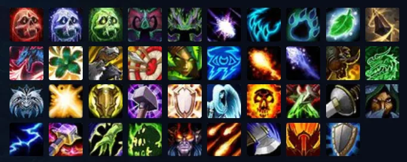

# Agents & Skills for Claude Code



This repository contains **Agents** and **Skills** for Claude Code and OpenCode. Built with [dagRobin](https://github.com/afa7789/dagRobin) and [differ_helper](https://github.com/afa7789/differ_helper).

## Agents vs Skills

| | Agents | Skills |
|---|---|---|
| **What** | Autonomous executors with tool access | Knowledge/methodology injected as context |
| **How** | Invoked as subagents via the Agent tool | Loaded via slash commands |
| **Location** | `~/.claude/agents/<name>.md` | `~/.claude/skills/<name>/SKILL.md` |
| **Format** | Single `.md` with tools/model in frontmatter | `SKILL.md` inside a directory |

## Available Agents (7)

| Agent | Model | Purpose |
|-------|-------|---------|
| **orchestrator** | opus | Multi-agent pipeline coordinator. Assesses complexity, creates task DAGs, dispatches agents, manages build-evaluate-fix loops |
| **architect** | sonnet | Research & planning. Explores codebases, designs architecture, creates implementation plans |
| **builder** | sonnet | Core implementation. TDD, debugging, sprint contracts, code changes |
| **qa-evaluator** | sonnet | Live Playwright testing. Grades builds against weighted criteria, skeptical by default |
| **code-reviewer** | sonnet | Weighted code review with scored verdicts. Two-stage: spec compliance then quality |
| **project-manager** | sonnet | Task coordination via dagRobin. Decomposes specs into tasks with full context |
| **summarizer-auditor** | haiku | Audits .claude/ folders. Creates SUMMARY.md and AUDIT.md |

## Available Skills (3)

| Skill | Purpose |
|-------|---------|
| **estimator** | Token counting methodology, cost estimation formulas, pricing tables |
| **differ-helper** | Git diff analysis workflow: extract entities, find duplicates, check deprecations |
| **prompt-refiner** | Iterative refinement methodology. Sharpens vague ideas into specific prompts before sending to architect |

## dagRobin Integration

All agents coordinate through **dagRobin** for multi-agent task management. The workflow varies by complexity:

### Complex Projects (full pipeline)
```
orchestrator assesses -> Complex
  1. architect -> product spec + technical plan
  2. project-manager -> dagRobin tasks
  3. builder <-> qa-evaluator (build-evaluate-fix loop, max 3 rounds)
  4. code-reviewer -> final review
```

### Medium Projects (architect + builder + review)
```
orchestrator assesses -> Medium
  1. architect -> plan
  2. builder -> implements
  3. code-reviewer -> scored review
```

### Simple Tasks (builder only)
```
orchestrator assesses -> Simple
  1. builder -> fix and done
```

## Usage

### Invoke an Agent

Agents are invoked automatically by Claude Code when matching tasks are detected, or explicitly:

```
Use the orchestrator agent to build a Rust API with JWT auth and PostgreSQL.
```

```
Use the code-reviewer agent to review the latest changes.
```

### Load a Skill

Skills inject methodology into the conversation:

```
Load the estimator skill and estimate the token cost of this project.
```

```
Load the differ-helper skill and analyze the current diff.
```

### Example: Full Project from Scratch

```
Use the orchestrator agent.

Build a recipe manager app with meal planning and AI suggestions.
```

The orchestrator will:
1. Assess complexity -> Complex
2. Launch architect -> product spec + technical plan
3. Create dagRobin tasks
4. For each feature: sprint contract -> build -> QA evaluate -> fix loop
5. Final review -> done

### Example: Resume After Tokens Ran Out

```
Use the orchestrator agent.

Check dagRobin for pending tasks and continue working on this project.
```

## Installation

### Sync Script (recommended)

```bash
# Create a paths.txt:
# ~/.claude/skills
# /path/to/project1

# Sync agents to ~/.claude/agents/ and skills to target paths
./scripts/sync-skills.sh paths.txt
```

The sync script:
- Copies `agents/*.md` to `~/.claude/agents/`
- Copies skill directories to target paths
- Cleans up old agent entries from skill targets

### Manual Installation

```bash
# Agents -> ~/.claude/agents/
cp agents/*.md ~/.claude/agents/

# Skills -> ~/.claude/skills/
cp -r estimator differ-helper ~/.claude/skills/
```

## RTK (Rust Token Killer)

[RTK](https://github.com/rtk-ai/rtk) reduces LLM token consumption by 60-90% on common dev commands.

```bash
brew install rtk
rtk init -g          # Install hooks
rtk gain             # View token savings
```

## Creating Your Own

### Agent

Create `agents/<name>.md`:

```yaml
---
name: my-agent
description: What this agent does and when to use it
tools: ["Read", "Write", "Edit", "Bash", "Glob", "Grep"]
model: sonnet
---

You are <role>. Your job is to <responsibility>.

## Workflow
...
```

### Skill

Create `<name>/SKILL.md`:

```yaml
---
name: my-skill
description: What this skill provides
---

# Methodology / Reference Data
...
```

## Directory Structure

```
skills/
  agents/                    # Autonomous agents (.md files)
    orchestrator.md
    architect.md
    builder.md
    qa-evaluator.md
    code-reviewer.md
    project-manager.md
    summarizer-auditor.md
  estimator/                 # Skills (SKILL.md directories)
    SKILL.md
  differ-helper/
    SKILL.md
  prompt-refiner/
    SKILL.md
  resources/
  scripts/
    sync-skills.sh
    flatten-all.sh
    install-tools.sh
  CLAUDE.md
  ENGINEERING_STANDARDS.md
  DAGROBIN_STANDARDS.md
  RTK_STANDARDS.md
  TESTING.md
```

## Scripts

### sync-skills.sh

Syncs agents and skills to their correct locations.

```bash
./scripts/sync-skills.sh paths.txt
```

### flatten-all.sh

Consolidates all plans, tasks, and markdown files from `.claude` folders.

```bash
./scripts/flatten-all.sh              # All markdown
./scripts/flatten-all.sh -p agents    # Agent definitions only
./scripts/flatten-all.sh -p skills    # Skill definitions only
```

## Adding dagRobin

```bash
git clone https://github.com/afa7789/dagRobin.git
cd dagRobin && cargo build --release
cp target/release/dagRobin ~/.cargo/bin/dagRobin
```

Always gitignore the database:

```bash
grep -qxF 'dagrobin.db' .gitignore 2>/dev/null || echo 'dagrobin.db' >> .gitignore
```

### Auto-allow dagRobin commands

To avoid approving every dagRobin command manually, add this to your global Claude Code settings:

Add to `~/.claude/settings.json`:

```json
{
  "permissions": {
    "allow": [
      "Bash(dagRobin:*)"
    ]
  }
}
```

If you already have a `permissions.allow` array, just append `"Bash(dagRobin:*)"` to it. This allows all dagRobin subcommands (`list`, `ready`, `claim`, `update`, `import`, `export`, `graph`, `conflicts`, etc.) globally across all projects.
