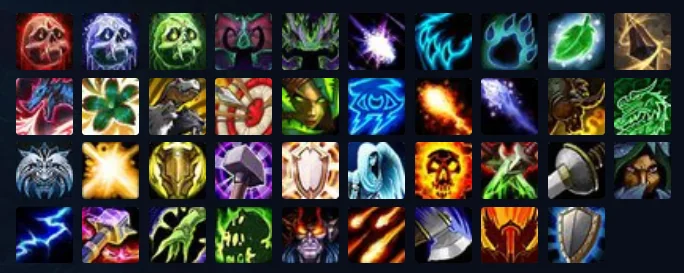

# Agents & Skills for Claude Code



This repository contains **Agents** and **Skills** for Claude Code, OpenCode, Codex CLI, Hermes Agent, [Pi](https://pi.dev/) and [OMP](https://omp.sh/). One script — `scripts/sync-skills.sh` — is the single source of truth that syncs them to all six. Built with [dagRobin](https://github.com/afa7789/dagRobin) and [differ_helper](https://github.com/afa7789/differ_helper).

## Agents vs Skills

| | Agents | Skills |
|---|---|---|
| **What** | Autonomous executors with tool access | Knowledge/methodology injected as context |
| **How** | Invoked as subagents via the Agent tool | Loaded via slash commands |
| **Location** | `~/.claude/agents/<name>.md` | `~/.claude/skills/<name>/SKILL.md` |
| **Format** | Single `.md` with tools/model in frontmatter | `SKILL.md` inside a directory |

## Available Agents

| Agent | Model | Purpose |
|-------|-------|---------|
| **orchestrator** | opus | Routes prompts, dispatches agents, runs the build-evaluate-fix loop |
| **architect** | sonnet | Explores codebases, designs architecture, writes the plan |
| **builder** | sonnet | Implements features, fixes bugs, wires up entry points |
| **qa-evaluator** | sonnet | Live-tests builds against weighted criteria, skeptical by default |
| **code-reviewer** | sonnet | Scored two-stage review: spec compliance then quality |
| **project-manager** | sonnet | Decomposes the plan into dagRobin tasks with full context |
| **summarizer-auditor** | haiku | Audits `.claude/` folders, reports status and drift |

## Available Skills

`/command` = user-invoked only, the agent will not fire it autonomously. Frontmatter `description` is the authority on scope and triggers; the clauses below are navigation only.

| Skill | Purpose |
|-------|---------|
| **reader** `/command` | Proofreads flow, crispness, duplicates, implicature |
| **prompt-refiner** `/command` | Sharpens a vague idea into a specific prompt |
| **differ-helper** | Diff analysis: entities, duplicates, deprecations, lint/tests |
| **estimator** | Token/cost/dev-hours estimation calibrated against measured history |
| **peer-review** `/command` | Persona panel on a document or decision |
| **pr-review-pipeline** | Diff review: spec compliance, scored quality, structured report |
| **multi-agent-loop** | Autonomous dagRobin execution loop with gap detection |
| **ste-docs** `/command` | Rewrites repo docs into ASD-STE100 Simplified Technical English |
| **repo-audit** | Deletion-first over-engineering audit, FULL (repo-wide) or DIFF mode |
| **docs-audit** `/command` | Verifies every doc claim against code, fixes drift and placement |
| **frontend-audit** | Exhaustive screen/state UI/UX audit with deterministic screenshots |
| **solidity-review** | 35-check Solidity/EVM security review with severity report |
| **solidity-complex-audit** `/command` | Full multi-phase Solidity audit with reproducing exploit tests |
| **better-accessibility** | Focus, keyboard, ARIA, forms, WCAG 2.2 AA |
| **better-layout** | Grouping, spacing, progressive disclosure, breakpoints, RTL |
| **better-writing** | Button labels, error messages, empty states, voice and tone |
| **better-typography** | Type scale, line-height, wrapping, truncation, variable fonts |
| **better-colors** | OKLCH palettes, contrast, gamut, semantic tokens, dark mode |
| **better-ui** | Animation, shadows, icons, border radius, motion restraint |
| **better-interface** | Frontend gateway routing shape/build/critique/polish/harden work |

## For Agents

> This section is written for AI agents (and humans onboarding fast). It tells you **which agent/skill to invoke for which phase**, and **where to enter the pipeline** based on what you already have.

### Phases & Entry Points

You don't have to start from the orchestrator. Each agent maps to a phase of the workflow — pick the entry point that matches what you already have in hand.

### Phases

| Phase | Goal | Agent | Skill (optional) |
|-------|------|-------|------------------|
| **0. Refine** | Sharpen a vague idea into a specific prompt | — | `prompt-refiner` |
| **1. Discovery** | Explore an unknown codebase, answer "how does X work?" | `architect` (research mode) | — |
| **2. Planning** | Turn a spec into a technical plan + task graph | `architect` → `project-manager` | `estimator` (cost/tokens) |
| **3. Implementation** | Write the code (TDD, debug, sprint contracts) | `builder` | `differ-helper` (after diffs) |
| **4. Validation** | Live-test the build against weighted criteria | `qa-evaluator` | `frontend-audit` (UI/UX + a11y audit) |
| **5. Review** | Scored code review, multi-perspective critique | `code-reviewer` | `peer-review`, `reader` |
| **6. Audit** | Inventory `.claude/` folders, find drift | `summarizer-auditor` | — |
| **∞. Coordinate** | Run multiple phases / agents in parallel | `orchestrator` | `multi-agent-loop` |

### Pick your entry point

| What you already have | Start with | Skip |
|-----------------------|------------|------|
| A vague idea | `prompt-refiner` skill | — |
| A clear spec but no plan | `architect` | refine |
| A plan, no tasks yet | `project-manager` | refine, plan |
| A plan **and** tasks in dagRobin | `builder` (claim and go) | everything before |
| A frontend surface to shape, build, harden, adapt, or polish | `better-interface` skill | full audit |
| Code already written, want feedback | `pr-review-pipeline` for a diff, `code-reviewer` for one file | everything before |
| Code that needs to be tested live | `qa-evaluator` | review |
| An explicit exhaustive audit of every frontend screen/state | `frontend-audit` skill | everything before |
| Many independent tasks at once | `orchestrator` | nothing — it dispatches |
| Resuming after a context wipe | `orchestrator` ("check dagRobin and continue") | — |

### When NOT to use the orchestrator

The orchestrator is just a **dispatcher** — it assesses complexity and fans out work to other agents. If you already know which agent you need, call it directly. Skip the orchestrator when:

- You have one focused task → call `builder` directly.
- You only need a plan, not implementation → call `architect` directly.
- You only want a review of existing code → load `pr-review-pipeline` for a diff, or call `code-reviewer` for a single file.
- You're refining a prompt before any work starts → load `prompt-refiner`.

Use the orchestrator when you have **N independent tasks for N agents**, or when you're not sure which phase you're in and want it figured out for you.

### Common scenarios

**"I have a vague idea"**
```
Load the prompt-refiner skill. I want to build something with X and Y.
```

**"I want a plan, not code yet"**
```
Use the architect agent to design a plan for <feature>. Don't implement.
```

**"I have a plan, just build it"**
```
Use the builder agent. The plan is in PLAN.md / .claude/PLAN.md.
```

**"Review what I just wrote"**
```
Use the code-reviewer agent on the current branch.
```
or
```
Load the pr-review-pipeline skill for diff analysis and a scored report.
```

**"Test it like a user would"**
```
Use the qa-evaluator agent against <criteria>.
```

**"Audit and improve the UI of this app"**
```
Load the frontend-audit skill. Audit this frontend against Material Design 3.
```
It discovers every screen and state first, captures screenshots per viewport and
theme, runs a11y audits, then dispatches a parallel UX/UI/M3/a11y review panel.
Add "in fix mode" to have it implement P0/P1 and compare before/after.

**"Shape or improve a frontend surface"**
```
Load better-interface in <shape | build | critique | polish | harden | adapt> mode for <surface>.
```
It resolves product/design context, routes to the owning `/better-*` skills, and
uses a bounded narrow/wide visual gate. Use `frontend-audit` only for exhaustive coverage.

**"Estimate cost before I start"**
```
Load the estimator skill. Estimate tokens/cost for <project description>.
```

**"Full project from scratch, drive everything"**
```
Use the orchestrator agent. Build <full description>.
```

**"Resume after tokens ran out"**
```
Use the orchestrator agent. Check dagRobin for pending tasks and continue.
```

## dagRobin Integration

All agents coordinate through **dagRobin** for multi-agent task management. The workflow varies by complexity:

### Complex Projects (full pipeline)
```
orchestrator assesses -> Complex
  1. architect -> product spec + technical plan
  2. project-manager -> dagRobin tasks
  3. builder <-> qa-evaluator (build-evaluate-fix loop, max 3 rounds)
  4. code-reviewer -> final review
```

### Medium Projects (architect + builder + review)
```
orchestrator assesses -> Medium
  1. architect -> plan
  2. builder -> implements
  3. code-reviewer -> scored review
```

### Simple Tasks (builder only)
```
orchestrator assesses -> Simple
  1. builder -> fix and done
```

## Usage

### Invoke an Agent

Agents are invoked automatically by Claude Code when matching tasks are detected, or explicitly:

```
Use the orchestrator agent to build a Rust API with JWT auth and PostgreSQL.
```

```
Use the code-reviewer agent to review the latest changes.
```

### Load a Skill

Skills inject methodology into the conversation:

```
Load the estimator skill and estimate the token cost of this project.
```

```
Load the differ-helper skill and analyze the current diff.
```

### Multi-Agent Workflow

Load the multi-agent-loop skill for full workload execution:

```
Load the multi-agent-loop skill.

Build a full-stack app with auth, database, and real-time updates.
```

### Peer Review Panel

Load the peer-review skill for a persona panel on a document or decision (not a diff — diffs go through `pr-review-pipeline`):

```
Load the peer-review skill and run a panel on this design doc.
```

### Example: Full Project from Scratch

```
Use the orchestrator agent.

Build a recipe manager app with meal planning and AI suggestions.
```

The orchestrator will:
1. Assess complexity -> Complex
2. Launch architect -> product spec + technical plan
3. Create dagRobin tasks
4. For each feature: sprint contract -> build -> QA evaluate -> fix loop
5. Final review -> done

### Example: Resume After Tokens Ran Out

```
Use the orchestrator agent.

Check dagRobin for pending tasks and continue working on this project.
```

## Installation

### Sync Script (recommended)

```bash
./scripts/sync-skills.sh
```

Destinations are fixed — there is no `paths.txt`. Each target is synced only if
that tool is installed locally; anything absent is reported and skipped. Nothing
is auto-installed.

| Target | Destination | What it receives |
|---|---|---|
| Claude Code | `~/.claude/` | `agents/` verbatim, `skills/`, `rules/`, `resources/`, `global/CLAUDE.md` |
| OpenCode | `~/.config/opencode/` | agents translated (`tools:` CSV → `permission:` denials, `mode:` preserved, `model:` dropped), `skills/`, `rules/`, `resources/`, managed keys in `opencode.json` |
| Codex CLI | `~/.codex/` | `skills/`, plus `approval_policy` + `sandbox_mode` in `config.toml` |
| Hermes Agent | `~/.hermes/` | skills grouped into category subdirs, agents converted to slash commands, `SOUL.md` composed, skill-bundles, `approvals` + `command_allowlist` in `config.yaml` |
| [Pi](https://pi.dev/) | `~/.pi/agent/` | `skills/` verbatim (Pi uses the same `SKILL.md` format), agents translated to Pi's lowercase built-in tool names, global `AGENTS.md` composed |
| [OMP](https://omp.sh/) | `~/.omp/agent/` | `skills/` verbatim (same `SKILL.md` format), agents translated to OMP's lowercase tool names with `model:` dropped |

Pi's `settings.json` has no permission, sandbox or tool-allowlist surface, so
`--mode` does not apply to it — that target is content-only, and its
`settings.json` (your provider and model choices) is never touched. Claude tools
map to Pi's built-ins as `Read→read`, `Edit→edit`, `Write→write`, `Grep→grep`,
`Bash→bash`, `Glob→find, ls`; anything without a Pi equivalent (`Agent`,
`WebFetch`, …) is dropped rather than guessed at.

OMP reads native config from `~/.omp/agent/`, so that target writes `skills/` and
`agents/` only. Claude tools map to OMP's built-ins as `Read→read`, `Edit→edit`,
`Write→write`, `Grep→grep`, `Bash→bash`, `Glob→glob`, `Agent`/`Task→task`,
`WebSearch`/`WebFetch→web_search`, `TodoWrite→todo`; anything without an OMP
equivalent is dropped rather than guessed at. `model:` and `mode:` are stripped:
OMP resolves models from `modelRoles` in its own `config.yml`, and a pinned
Claude alias (`sonnet`, `opus`, `haiku`) is not an OMP selector. OMP's
`config.yml`, `AGENTS.md` and `models.yml` are yours — the script never writes
them.

**Managed settings are merged, never overwritten.** Only the keys the script owns
are touched; everything else in your `config.toml` / `opencode.json` /
`config.yaml` is preserved, comments included. A config that fails to parse is
backed up and left alone rather than clobbered.

Runs are idempotent: SHA-256 checksums are cached in `~/.afasync/state.json` and
unchanged steps are skipped.

#### Options

| Flag | Meaning |
|---|---|
| `--mode=strict\|smart\|yolo` | Trust level for the managed permission settings (default `smart`) |
| `--only=T[,T...]` | Limit to some targets: `claude`, `opencode`, `codex`, `hermes`, `pi`, `omp` |
| `--skip-sync` | Only update managed settings, don't copy content |
| `--skip-permissions` | Only copy content, don't touch managed settings |
| `--force` | Ignore cached checksums; redo everything |
| `--status` | Dry run — report what would change, write nothing |
| `--reset` | Clear the cached state, then run |
| `-h`, `--help` | Show usage |

#### Environment

| Variable | Meaning |
|---|---|
| `HERMES_HOME` | Override `~/.hermes` |
| `PI_HOME` | Override `~/.pi` |
| `OMP_HOME` | Override `~/.omp` |
| `AFSYNC_STATE` | Override `~/.afasync/state.json` |
| `AFSYNC_QUIET=1` | Compact output (errors are still shown) |
| `AFSYNC_BACKUP_KEEP` | How many `.bak-*` to retain per file (default 5) |
| `HERMES_ADAPTER_WRITE_AGENTS=1` + `HERMES_ADAPTER_PROJECT_DIR=<dir>` | Also write `<dir>/AGENTS.md` from the engineering/rtk/dagrobin rules plus any auto-detected stack rule |

A single positional argument (historically `paths.txt`) is still accepted and
ignored, so older documented invocations keep working.

#### Tests

```bash
bash scripts/test-sync-skills.sh      # sandboxed; never touches your real config
shellcheck -S style scripts/*.sh
```

### Manual Installation

```bash
# Agents -> ~/.claude/agents/
cp agents/*.md ~/.claude/agents/

# Skills -> ~/.claude/skills/
cp -r skills/reader skills/prompt-refiner skills/differ-helper skills/estimator skills/peer-review skills/pr-review-pipeline skills/multi-agent-loop skills/ste-docs skills/docs-audit skills/repo-audit skills/frontend-audit skills/better-* ~/.claude/skills/
```

## RTK (Rust Token Killer)

[RTK](https://github.com/rtk-ai/rtk) reduces LLM token consumption by 60-90% on common dev commands.

```bash
brew install rtk
rtk init -g          # Install hooks
rtk gain             # View token savings
```

## MemPalace

[MemPalace](https://github.com/mempalace/mempalace) is a local-first AI memory system that stores conversation history as verbatim text with semantic search. No summarization, no API calls, 96.6% R@5 on LongMemEval.

```bash
pip install mempalace
mempalace init ~/.claude/projects/    # Initialize for Claude Code sessions

# Mine project context
mempalace mine ~/.claude/projects/ --wing myproject

# Search past sessions
mempalace search "why did we switch to GraphQL"
```

Integrates with Claude Code, MCP, and provides auto-save hooks before context compression.

## Creating Your Own

### Agent

Create `agents/<name>.md`:

```yaml
---
name: my-agent
description: What this agent does and when to use it
mode: subagent
tools: Read, Write, Edit, Bash, Glob, Grep
model: sonnet
---

You are <role>. Your job is to <responsibility>.

## Workflow
...
```

### Skill

Create `<name>/SKILL.md`:

```yaml
---
name: my-skill
description: What this skill provides
---

# Methodology / Reference Data
...
```

## Directory Structure

```
root/
  agents/                    # Autonomous agents (.md files)
    orchestrator.md
    architect.md
    builder.md
    qa-evaluator.md
    code-reviewer.md
    project-manager.md
    summarizer-auditor.md
  skills/                    # Skills (SKILL.md directories)
    reader/
    prompt-refiner/
    differ-helper/
    estimator/
    peer-review/
    pr-review-pipeline/       # SKILL.md + reference/
    multi-agent-loop/         # SKILL.md + reference/
    ste-docs/                 # SKILL.md + reference/
    repo-audit/                # SKILL.md + reference/
    docs-audit/                # SKILL.md + reference/
    frontend-audit/            # SKILL.md + reference/ + assets/ + scripts/
    solidity-review/           # SKILL.md + reference/
    solidity-complex-audit/    # SKILL.md + reference/
    better-accessibility/      # SKILL.md
    better-layout/             # SKILL.md
    better-writing/            # SKILL.md
    better-typography/         # SKILL.md
    better-colors/             # SKILL.md
    better-ui/                 # SKILL.md
    better-interface/          # gateway + context/playbook references + templates + tests
  rules/                     # Language, framework & project rules
    engineering.md
    dagrobin.md
    git.md
    rtk.md
    voice-adhd.md
  docs/
    TESTING.md               # Manual pipeline test procedure
  global/
    CLAUDE.md                # Global agent rules, synced to ~/.claude/CLAUDE.md
  resources/
    image.png
    generic-chain-prompt.md
    stacks/                  # Per-stack conventions
      golang.md
      python.md
      rust.md
      svelte.md
      tauri.md
      typescript.md
  scripts/
    sync-skills.sh
    test-sync-skills.sh      # Sandboxed test suite for the sync
    flatten-all.sh
    install-tools.sh
    templates/               # Hermes skill-bundles installed by the sync
      feature-bundle.yaml
  CLAUDE.md
```

## Scripts

### sync-skills.sh

Single source of truth: syncs agents, skills, rules and resources to Claude
Code, OpenCode, Codex CLI and Hermes Agent, and merges the managed permission
settings into each tool's own config. See
[Installation → Sync Script](#sync-script-recommended) for the full option list.

```bash
./scripts/sync-skills.sh              # sync everything that's installed
./scripts/sync-skills.sh --status     # dry run
./scripts/sync-skills.sh --only=claude --force
```

### test-sync-skills.sh

Sandboxed test suite for `sync-skills.sh`. Runs the real script against a
throwaway `$HOME` under `mktemp -d`, so it can never touch your actual config.

```bash
bash scripts/test-sync-skills.sh
```

### flatten-all.sh

Consolidates all plans, tasks, and markdown files from `.claude` folders.

```bash
./scripts/flatten-all.sh              # All markdown
./scripts/flatten-all.sh -p agents    # Agent definitions only
./scripts/flatten-all.sh -p skills    # Skill definitions only
```

## Adding dagRobin

```bash
git clone https://github.com/afa7789/dagRobin.git
cd dagRobin && cargo build --release
cp target/release/dagRobin ~/.cargo/bin/dagRobin
```

Always gitignore the database:

```bash
grep -qxF '.dagrobin/' .gitignore 2>/dev/null || echo '.dagrobin/' >> .gitignore
```

### Auto-allow dagRobin commands

To avoid approving every dagRobin command manually, add this to your global Claude Code settings:

Add to `~/.claude/settings.json`:

```json
{
  "permissions": {
    "allow": [
      "Bash(dagRobin:*)"
    ]
  }
}
```

If you already have a `permissions.allow` array, just append `"Bash(dagRobin:*)"` to it. This allows all dagRobin subcommands (`list`, `ready`, `claim`, `update`, `import`, `export`, `graph`, `conflicts`, etc.) globally across all projects.
